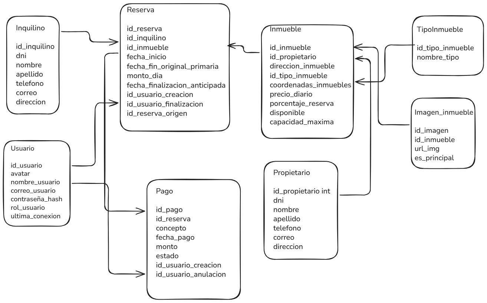

# Proyecto inmobiliaria: reservas temporales

## Integrantes

Erica Castro
-correo: erica.castro.0615@gmail.com
-usuario github: [eriadr0615](https://github.com/eriadr0615)
-usuario discord: erica_19340

Sebastian Castro
-correo: castrosebastian87@gmail.com
-usuario github: [ssebasss](https://github.com/ssebasss)

## Descripcion

sistema web gestado para la administración de alquileres temporarios regentiado por una inmobiliaria.

### Modelado de datos

Esquema de modelo de datos perteneciente a la app:

#### Primera entrega :

- alta, baja, modificación de entidad Propietario
- alta, baja, modificacion de entidad Inquilinos

#### Diagrama

Diagrama de entidad relacion

## Base de datos
