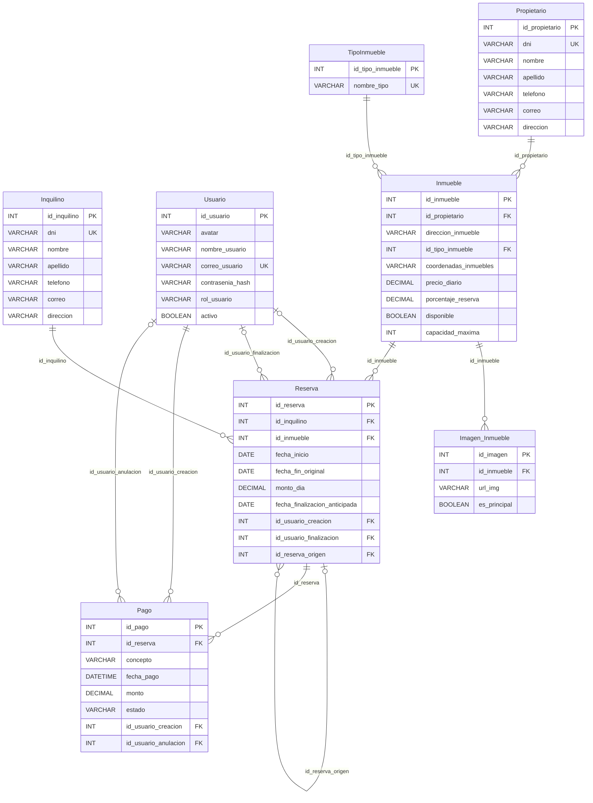

# Proyecto inmobiliaria: reservas temporales

## Integrantes

- Erica Castro
  - Correo: erica.castro.0615@gmail.com
  - GitHub: [eriadr0615](https://github.com/eriadr0615)
  - Discord: erica_19340
- Sebastian Castro
  - Correo: castrosebastian87@gmail.com
  - GitHub: [ssebasss](https://github.com/ssebasss)

## Descripción y alcance

Sistema web para administrar alquileres temporarios de una inmobiliaria, según la [narrativa del proyecto](./Narrativa_Proyecto_Reservas_Temporales.pdf).

La implementación mantiene ASP.NET Core MVC, vistas Razor, repositorios con interfaces e inyección de dependencias, ADO.NET/MySqlConnector y autenticación por cookies. Las búsquedas de los formularios usan jQuery y JSON. No se incorporaron Entity Framework, JWT ni otro framework para esta entrega.

### Primera entrega

- Alta, baja y modificación de propietarios e inquilinos.

### Segunda entrega

- Alta, baja, modificación y detalle de inmuebles, tipos de inmueble y reservas.
- Imágenes y portada de los inmuebles; cada inmueble pertenece a un propietario.

### Entrega final

- Inicio y cierre de sesión; roles Administrador y Empleado.
- Administración de usuarios por el Administrador; perfil, contraseña y avatar propios para ambos roles.
- Eliminaciones reservadas al Administrador.
- Confirmación de la reserva con la seña exigida por el inmueble.
- Pagos por reserva: alta, consulta, edición del concepto y anulación lógica por el Administrador.
- Finalización anticipada: fecha efectiva separada de la original, cálculo de multa y registro del pago.
- Renovación como una reserva nueva, vinculada a la original, con nuevas fechas y monto diario.
- Auditoría de creación/finalización de reservas y creación/anulación de pagos, visible al Administrador en los detalles.
- Informes, paginado y búsquedas en el servidor; selección por búsqueda AJAX en los formularios relacionados.

La reserva y su seña se guardan en una misma transacción ADO.NET. Lo mismo ocurre con la finalización anticipada y su pago: si falla una operación, se revierte el conjunto. La disponibilidad vuelve a comprobarse al guardar.

Suspender un inmueble impide nuevas reservas, pero no modifica las existentes. Las bajas respetan las relaciones de la base: no se elimina un registro utilizado por otro. Anular un pago conserva su registro, por lo que también mantiene esa relación.

### Informes

Desde el menú **Informes** se accede a:

1. Inmuebles con propietario, con filtro de disponibilidad.
2. Inmuebles de un propietario, buscado por DNI.
3. Inmuebles más reservados en el último año.
4. Inmuebles sin reservas en los últimos X días (30 por defecto).
5. Reservas vigentes.
6. Reservas por terminar en los próximos X días (30 por defecto).
7. Pagos de una reserva, con acceso a registrar otro pago.
8. Inmuebles libres entre dos fechas.

Los listados se consultan por páginas de 10 registros mediante `LIMIT/OFFSET`. Las búsquedas AJAX devuelven hasta 10 coincidencias; se puede refinar el texto. El pequeño catálogo de tipos se carga completo en el desplegable de inmuebles.

## Diagrama de entidad-relación

El diagrama corresponde a las tablas y columnas de [reservas_temporales.sql](./reservas_temporales.sql). PK identifica la clave primaria; FK, una clave foránea; UK, un valor único. Los tamaños y valores por defecto están en el SQL.



`TipoInmueble` tiene dos columnas: `id_tipo_inmueble` y `nombre_tipo`. La relación está en `Inmueble.id_tipo_inmueble`; ni la dirección ni las coordenadas son claves foráneas. Una renovación referencia a la reserva original mediante `id_reserva_origen`.

## Puesta en marcha

### Requisitos

- SDK de .NET 10.
- Servidor MySQL instalado y en ejecución.
- MySQL Workbench u otro cliente para ejecutar el script.

### 1. Crear e inicializar la base

Abrir [reservas_temporales.sql](./reservas_temporales.sql) en MySQL Workbench y ejecutarlo en una instalación nueva. Crea la base `reservas_temporales`, sus ocho tablas y los datos iniciales.

> Atención: el script empieza con `DROP DATABASE IF EXISTS reservas_temporales`. Ejecutarlo otra vez borra la base existente y sus datos. No usarlo para actualizar una base con información que se quiera conservar.

La base ejecutada se guarda en el servidor MySQL, no dentro del repositorio. Git comparte el archivo SQL, pero un commit, push o pull no actualiza automáticamente la base local. Tampoco lo hace `dotnet run`. Si la base ya existe, primero se comparan los cambios necesarios y se hace una copia de respaldo.

### 2. Configurar la conexión local

Revisar `ConnectionStrings:DefaultConnection` en la configuración del proyecto y ajustar servidor, puerto, usuario y contraseña:

```json
"ConnectionStrings": {
  "DefaultConnection": "Server=localhost;Port=3306;Database=reservas_temporales;User=root;Password=CAMBIAR_CLAVE;SslMode=None;"
}
```

En desarrollo, `appsettings.Development.json` puede sobrescribir `appsettings.json`. El proyecto también admite la configuración local de secretos de .NET. Usar credenciales de la instalación propia y no publicar contraseñas personales.

Agregar un archivo a `.gitignore` no deja de versionarlo si Git ya lo tenía registrado; revisar los cambios antes de compartir configuración local.

### 3. Restaurar, compilar y ejecutar

Desde la carpeta del proyecto:

```bash
dotnet restore
dotnet build
dotnet run
```

Abrir la URL que indique la consola, por ejemplo `http://localhost:5277`.

## Usuarios de prueba

El script inicial crea estas cuentas:

| Rol | Correo | Contraseña |
| --- | --- | --- |
| Administrador | `admin@inmobiliaria.com` | `Admin123!` |
| Empleado | `empleado@inmobiliaria.com` | `Empleado123!` |

Las contraseñas se guardan como hashes PBKDF2 con salt. No hay registro público: el Administrador crea los usuarios desde el sistema.

## Comprobaciones para la entrega

Realizar las pruebas con datos de prueba:

- Ingresar con ambos roles. Verificar que el Empleado no pueda administrar usuarios ajenos, eliminar entidades ni anular pagos, incluso entrando por URL.
- Crear y editar propietarios, inquilinos y tipos. Repetir un DNI o nombre de tipo: debe aparecer el error en el formulario sin perder los datos ingresados.
- Intentar eliminar entidades relacionadas: debe explicarse el impedimento y conservarse la información.
- Verificar en el detalle de un inmueble su tipo, propietario, datos e imágenes.
- Buscar en desplegables, cambiar rápidamente el texto y las fechas de una reserva: no deben reaparecer respuestas antiguas. Al editar, la selección existente se conserva y se valida nuevamente al guardar.
- Crear una reserva con seña. Revisar que la vista previa no la guarde y que la confirmación registre reserva y pago juntos. Probar fechas superpuestas y un inmueble suspendido.
- En pagos, verificar que solo se modifique el concepto y que los anulados sigan visibles.
- Finalizar antes y después de la mitad de la estadía: comprobar respectivamente 50% y 25% del importe de los días restantes. Cambiar la fecha en la vista previa debe exigir recalcular. Verificar que no se duplique la finalización ni su pago.
- Renovar: comprobar que la nueva reserva conserve inmueble e inquilino, tome las nuevas fechas y precio y no cambie la original.
- Recorrer los ocho informes con resultados, sin resultados y filtros inválidos. Usar más de 10 registros y comprobar que el paginado conserve los filtros.
